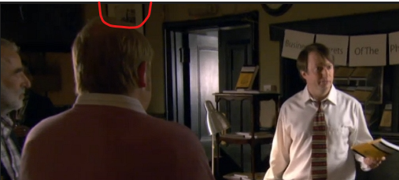
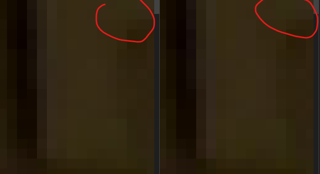

# Example

The example below showcases before and after a message has been embedded into the image. This image below taken from a hilarious British TV show called **Peep Show.**

<table>
  <thead>
    <tr>
      <td>bsotp.jpg (before)</td>
      <td>bsotp_jpeg_output.png (after)</td>
    </tr>
  </thead>
  <tbody>
    <tr>
      <td></td>
      <td></td>
    </tr>
  </tbody>
</table>

Other than the file name being different, there aren't any clear differences from the two images above.



Let's check out some pixel differences by zooming in on the picture frame on the wall.



You can ever so slightly notice some pixel differences from the original (left) and the modified (right) image. This is because each pixel is storing a character in the RGB values of the pixel using the Least Significant Bits.

You would hardly suspect that there's actually a message hidden inside the picture on the right, nor would you be able to tell that it has been modified unless you have the original to compare side to side.

Let's see what Mr. Mark Corrigan is trying to sell us here:

Download [this file](./bsotp_jpeg_output.png) and put it somewhere you can easily reference in a terminal or powershell

```bash
# if you cloned the repo and are running with go
go run main.go extract --target bsotp_jpeg_output.png

# if you downloaded the compiled binary
steggo extract --target bsotp_jpeg_output.png

# or .exe
steggo.exe extract --target bsotp_jpeg_output.png
```
